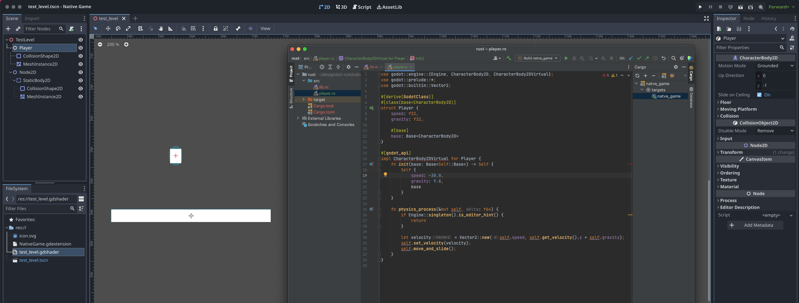

# Godot GDExtension Rust Example

This is a minimal example that uses [gdext](https://github.com/godot-rust/gdext) to implement a custom native GDExtension using rust.

### Instructions:

1. Build the `./rust` library with `cargo build`.
2. Load the Godot project in `./godot`
3. Run the example `test_level` scene.

